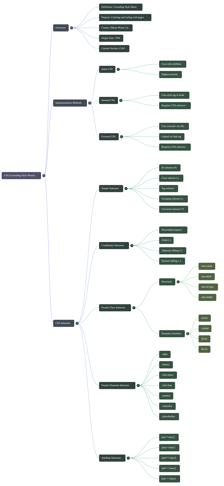

# DAY-4 HTML & CSS Notes

##  Multimedia Tags (HTML5)
> Multimedia tags were introduced in **HTML5**.  
> These tags are used to display **videos, audios, Google Maps, YouTube videos, and external websites** inside a web page.

### 1️ `<video>` Tag
The `<video></video>` tag is used to display **external video files** on a web page.

**Attributes:**
- src
- controls
- loop
- height
- width
- autoplay
- muted

```html
<video src="movie.mp4" controls width="400" height="300"></video>
```

### 2️ `<audio>` Tag
The `<audio></audio>` tag is used to display **external audio files**.

**Attributes:**
- src
- controls
- loop
- autoplay
- muted

```html
<audio src="song.mp3" controls></audio>
```

### 3️ `<iframe>` Tag
Used to embed **YouTube videos, Google Maps, webpages**.

**Attributes:**
- src
- frameborder
- height
- width

```html
<iframe src="https://www.youtube.com/embed/xyz" width="560" height="315"></iframe>
```

---

##  Semantic Tags (HTML5)
Semantic tags define the **structure of a webpage**, improve **SEO**, and increase **code readability**.

- nav
- main
- header
- footer
- section
- article
- aside
- figure
- strong
- em
- details

---

<h2 align="center">CSS (Cascading Style Sheets)</h2>
CSS is used to apply **colors, layouts, animations, and responsive designs**.

- Proposed: 1994
- Released: 1996 (W3C)
- Current Version: CSS3

---

##  Methods to Apply CSS

### Inline CSS
```html
<h1 style="color:red;">Hello</h1>
```

### Internal CSS
```html
<style>
h1 { color: blue; }
</style>
```

### External CSS
```html
<link rel="stylesheet" href="style.css">
```

---

##  CSS Selectors
CSS selectors are used to target HTML elements.

### Types:
- Universal Selector
- Element Selector
- Class Selector
- ID Selector
- Group Selector
- Attribute Selector
- Pseudo-class Selector
- Pseudo-element Selector

---

## 🖼️CSS Selectors Mind Map

